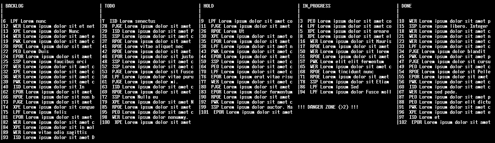

KANBAN.bash 
===========
commandline asciii kanban board for minimalist productivity bash hackers (csv-based)

## Usage

    Usage:

      kanban show                             # show ascii kanban board
      kanban <id>                             # edit or update item 
      kanban <id> <status>                    # update status of todo id (uses $EDITOR as preferred editor)
      kanban <status>                         # show only todo items with this status 
      kanban add <status> <col1> <col2> ...   # add item 

      NOTE #1: statuses can be managed in ~/.kanban.conf
      NOTE #2: the database csv can be found in ~/.kanban.csv

    Environment:

      You can switch context (e.g. work vs home vs project x ) like so:

      KANBANFILE=~/.kanban.foo.csv kanban show

## Install

## Show me the kanban board!

    $ ./kanban add PRIV "buy rose for girlfriend" "foo bar"
    $ ./kanban show

## Edit item 

    $ ./kanban 34

> NOTE: make sure you have your favorite editor set in ~/.bashrc : 'export EDITOR=vim' etc

## Change status 

    $ ./kanban show

    | IN_PROGRESS
    |
    |
    | 34 PRIV buy rose for girlfriend

    $ ./kanban 34 DONE

## Configuration 

see ~/.kanban.conf (gets created automatically)

    # kanban config file

    statuses=('BACKLOG' 'TODO' 'HOLD' 'IN_PROGRESS' 'DONE') 

    # maximum amount of todos within status (triggers warning when exceeds)
    declare -A maximum_todo
    maximum_todo['IN_PROGRESS']=6

## Attention UNIX ninjas 

    $ cp kanban ~/bin 
    $ echo 'export PATH=$PATH:~/bin' >> ~/.bashrc
    $ echo 'alias k=kanban'          >> ~/.bashrc

Now the true ninja can do commands like: 'k 23 DONE'

    $ k 34 DONE 
    TODO -> DONE
    $ k add TODO NINJW workout" "$(date --date='tomorrow' +'%Y-%m-%d') deadline"
    $ k TODO 
    TODO  ISD   Lorem                       senectus
    TODO  PJGE  Lorem ipsum dolor sit amet  consectetuer adipiscing                   
    TODO  ISD   Lorem ipsum dolor sit amet  Phasellus
    TODO  NINJW workout                     2024-04-08 deadline
    
> NOTE: optionally you can set `alias k=~/bin/kanban` in your ~/.bashrc 

## Why 

> *For developers, there's no such thing as the ultimate todo-utility*

KANBAN.bash brings the lean and mean kanban board to the console.
It uses csv as database backend, a very popular tabular format.
The commandline usage is very minimal so few keystrokes can do magic.

