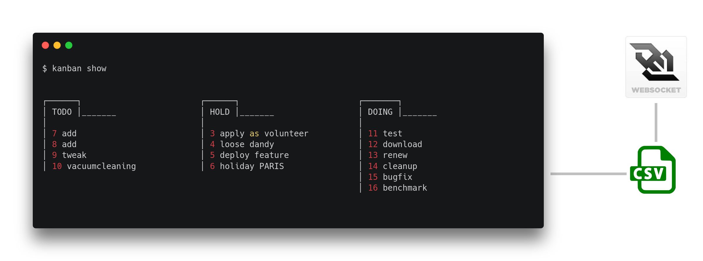

 

commandline #notetaking #todomanager for teams/personal: kanbanboard csv-viewer for minimalist productivity hackers.

> WHY: bitbucket/github/issuetrackers are great for teams, but how to manage todo's on a crossrepo- or microlevel? KANBAN.bash is a very simple **powerful** tool to manage and measure productivity. Just store the 
CSV-file(s) on a repo, clouddrive or server and use it across teams.

## Install

    $ curl -LO "https://raw.githubusercontent.com/coderofsalvation/kanban.bash/master/kanban"
    $ chmod 755 kanban
  
## Show me the kanban board!

    $ ./kanban add TODO PERSONAL "buy rose for girlfriend foo bar"
    $ ./kanban show

> NOTE: columns are configurable, and board resizes according to terminal width

## Change status 

    $ ./kanban show
    $ ./kanban 34 DONE
    IN_PROGRESS -> DONE

## Edit item 

> NOTE: make sure you have your favorite editor set in ~/.bashrc : 'export EDITOR=vim' etc

    $ ./kanban 34

## Todo grep 

    $ ./kanban TODO DOING | grep projectfoo 

Nice to get project-specific kanban overviews.

## Note-taking

> adding a filename as a description, will trigger kanban to open editor:

    $ echo -e "hello\nworld" > my_idea.txt
    $ kanban add TODO note my_idea.txt
    $ kanban list
      id  status   tag        description
      -   -        -          -                                                                                                                                                                -
      4   TODO     note       my_idea.txt
    $ k 4

> TIP: use symlinks to share notes across boards (`cd myproject && ln -s ~/.kanban/timelog.txt timelog.txt` e.g.)

## Simple listing of status 

> NOTE: from here we use the k-alias, see the 'Attention Unix ninjas' on how to use it 

    $ k TODO
    id   status  tag   description                 history
    -    -       -     -                           -
    185  TODO    bly   fooo bar flop               BTBDHDHDHT
    199  TODO    bly   meeting about techdesign    BT
    245  TODO    lb    checkout testsuite          BT
    246  TODO    nus   add field to db             BT
    242  TODO    nus   fix db lag                  BT

as you can see in the history, todo 185 is quite problematic.
It went from Backlog->Todo->Backlog->Doing->Hold->... and so on.
Obviously the person who assigned this todo should rethink it, and chop it up into seperate todos.
    
    $ k TODO 2015-08
    id   status  tag   description                 history
    -    -       -     -                           -
    246  TODO    nus   add field to db             BT
    242  TODO    nus   fix db lag                  BT

Here you can see all todo's which were 'touched' in august 2015

## Configuration 

see ~/.kanban/kanban.conf (gets created automatically).
You can define the kanban statuses, and limit the maximum amount of todos per status.

## Commandline Overview 

    $ ./kanban
    Usage:

      kanban add                              # add item interactive (adviced) 
      kanban show [status] ....               # show ascii kanban board [with status]
      kanban <id>                             # edit or update item 
      kanban <id> <status>                    # update status of todo id (uses $EDITOR as preferred editor)
      kanban <status> .....                   # list only todo items with this status(es)
      kanban list                             # list all todos (heavy)
      kanban tags                             # list all submitted tags
      kanban add <status> <tag> <description> # add item (use quoted strings for args)  
      kanban stats status [tag]
      kanban stats tag 
      kanban stats history 

      NOTE #1: statuses can be managed in ~/.kanban/.kanban.conf
      NOTE #2: the database csv can be found in ~/.kanban/.kanban.csv

    Examples:

      kanban add TODO projectX "do foo"
      kanban TODO DOING HOLD                 
      kanban stats status projectX
      kanban stats tag projectX 
      watch NOCOLOR=1 kanban show
      # notekeeping by entering a filename as description:
      echo hello > note.txt && kanban add DOING note.txt

    Environment:

      X=120 kanban ....         # set max line-width to 120
      NOCOLOR=1 kanban ....     # disable colors
      PLAIN=1 kanban ...        # plaintext, disable utf8 chars

## Interactive insertion *adviced*

Safest way to keep the CSV sane:

    $ ./kanban add
    enter description:
    > do laundry
    enter one of statuses: BACKLOG TODO IN_PROGRESS HOLD DONE
    > TODO
    enter one of tags: projectA, projectB 
    > 

## Customized kanban.

As mentioned earlier, the status/categorynames can be changed in the config-file.
No widescreen? Show a simplified kanban board by hiding some categories in the `kanban`-bashscript:

    #SMALLSCREEN=('HOLD' 'DOING')   # uncomment to only show these fields in kanban asciiboard

## Attention UNIX ninjas 

> type 'k' instead of './kanban' 

    $ cp kanban ~/bin 
    $ echo 'export PATH=$PATH:~/bin' >> ~/.bashrc
    $ echo 'alias k=kanban'          >> ~/.bashrc
    $ source ~/.bashrc

(now all terminals will recognize 'k' as a command)

> Cleanup your kanban board with some bash-fu:

    $ for i in {19,36,49}; do kanban $i BACKLOG; done
    DONE -> BACKLOG
    DONE -> BACKLOG
    DONE -> BACKLOG

> mass-renames:

    $ sed -i 's/FOO/BAR/g' ~/.kanban.csv
    
> Open a terminal on an extra monitor/screen/tmux:

    $ watch kanban show

> Run ninja-commands like: 'k 23 DONE' and withness the update:

    $ k 34 DONE 
    TODO -> DONE
    $ k add TODO NINJW workout" "$(date --date='tomorrow' +'%Y-%m-%d') deadline"

## Statistics

With the power of grep you can get overviews:

    $ k stats status

                DONE   155 ▆▆▆▆▆▆▆▆▆▆▆▆▆▆▆▆▆▆▆▆ 
             BACKLOG    73 ▆▆▆▆▆▆▆▆▆▆ 
                HOLD     9 ▆▆ 
                TODO     5 ▆ 
               DOING     5 ▆ 
    
    $ k status 2015-08

                DONE   155 ▆▆▆▆▆▆▆▆▆▆▆▆▆▆▆▆▆▆▆▆ 
             BACKLOG    73 ▆▆▆▆▆▆▆▆▆▆ 
                HOLD     9 ▆▆ 
                TODO     5 ▆ 
               DOING     5 ▆ 

    $ k stats status DONE 2015-08 

          projectfoo    62 ▆▆▆▆▆▆▆▆▆▆▆▆▆▆▆▆▆▆▆▆ 
          opensource    43 ▆▆▆▆▆▆▆▆▆▆▆▆▆▆ 
            projectX     3 ▆ 
               admin     2 ▆ 

    $ k stats status projectfoo 

                DONE    56 ▆▆▆▆▆▆▆▆ 
             BACKLOG    33 ▆▆▆▆▆ 
                HOLD     6 ▆ 
                TODO     2 ▆ 
               DOING     1 ▆ 

Lets see what the slacking / project ratio is :)

    $ k stats tag 2015-08

             slacking   76 ▆▆▆▆▆▆▆▆ 
             projecfoo  36 ▆▆▆▆ 

What are are typical tasktransitions:

    $ k stats history
                  T   129 ▆▆▆▆▆▆▆▆▆▆▆▆▆▆▆▆▆▆▆▆ 
            BTDHDHD    16 ▆▆▆ 
                  T   129 ▆▆▆▆▆▆▆▆▆▆▆▆▆▆▆▆▆▆▆▆ 
                 BD    16 ▆▆▆ 

View which projects were put on hold at least 2 times in 2014:

    $ k stats history HDHD 2014 

       project30     6 ▆▆▆▆▆▆▆▆▆▆▆▆▆▆▆▆▆▆▆▆ 
       project40     4 ▆▆▆▆▆▆▆▆▆▆▆▆▆▆ 
       project20     4 ▆▆▆▆▆▆▆▆▆▆▆▆▆▆ 
       project10     3 ▆▆▆▆▆▆▆▆▆▆ 

## Tab completion 

Somehow source `kanban.completion` in your `~/.bashrc` or just copy it to `/etc/bash_completion.d`

    
## Why 

> *For developers, there's no such thing as the ultimate todo-utility*

KANBAN.bash brings the lean and mean kanban board to the console.
It uses csv as database backend, a very popular tabular format.
The commandline usage is very minimal so few keystrokes can do magic.

## Developer info 

tests oneliners:

* run: `cd test; for test in test-*; do ./$test &>/dev/null; done && echo OK || echo ERROR` 
* debug: `cd test; for test in test-*; do bash -x $test; done && echo OK || echo ERROR`

## Todo 

* more testing
* easier way of adding todos
